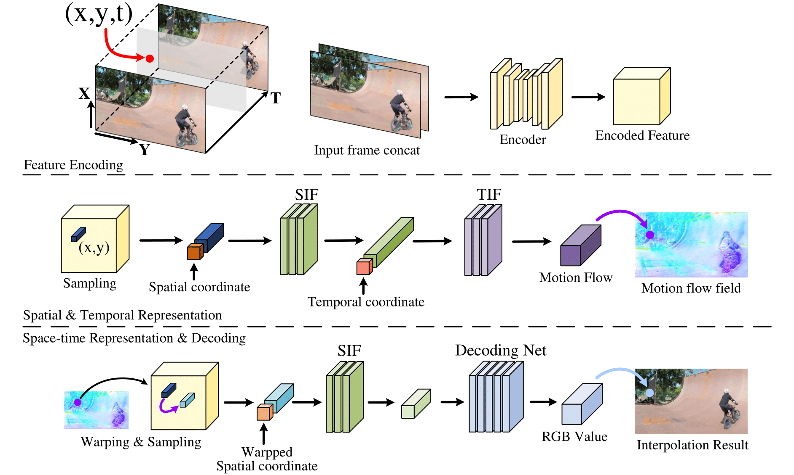

# VideoINR

This repository contains the official implementation for VideoINR introduced in the following paper:

[**VideoINR: Learning Video Implicit Neural Representation
for Continuous Space-Time Super-Resolution**](http://zeyuan-chen.com/VideoINR/)
<br>
[Zeyuan Chen](http://zeyuan-chen.com/), [Yinbo Chen](https://yinboc.github.io/), Jingwen Liu, [Xingqian Xu](https://scholar.google.com/citations?user=s1X82zMAAAAJ&hl=en), [Vidit Goel](https://vidit98.github.io/), [Zhangyang Wang](https://express.adobe.com/page/CAdrFMJ9QeI2y), [Humphrey Shi](https://www.humphreyshi.com/), [Xiaolong Wang](https://xiaolonw.github.io/)
<br>
CVPR 2022

You can find more visual results and a brief introduction to VideoINR at our [project page](http://zeyuan-chen.com/VideoINR/).

## Method Overview



Two consecutive input frames are concatenated and encoded as a discrete feature map. Based on the feature, the spatial and temporal implicit neural representations decode a 3D space-time coordinate to a motion flow vector. We then sample a new feature vector by warping according to the motion flow, and decode it as the RGB prediction of the query coordinate.

## Citation

If you find our work useful in your research, please cite:

```
@inproceedings{chen2022vinr,
  author    = {Chen, Zeyuan and Chen, Yinbo and Liu, Jingwen and Xu, Xingqian and Goel, Vidit and Wang, Zhangyang and Shi, Humphrey and Wang, Xiaolong},
  title     = {VideoINR: Learning Video Implicit Neural Representation for Continuous Space-Time Super-Resolution},
  journal   = {Proceedings of the IEEE/CVF Conference on Computer Vision and Pattern Recognition},
  year      = {2022},
}
```


## Environmental Setup

The code is tested in:
- Python 3.6
- Pytorch 1.4.0
- torchvision 0.5.0
- Cuda 10.1
- [Deformable Convolution v2](https://arxiv.org/abs/1811.11168). Following [Zooming Slowmo](https://github.com/Mukosame/Zooming-Slow-Mo-CVPR-2020), we adopt [CharlesShang's implementation](https://github.com/CharlesShang/DCNv2) in the submodule.

If you are using Anaconda, the following command can be used to build the environment:


```
conda create -n videoinr python=3.6
conda activate videoinr
conda install pytorch=1.4 torchvision -c pytorch

pip install opencv-python pillow tqdm
cd models/modules/DCNv2/
python setup.py install
```

## Demo

1. Download the pre-trained model from [google drive](https://drive.google.com/file/d/1JW_-ef_oHAmPZkssiXvOspIAn_poymK9/view?usp=sharing).

2. Convert your video of interest to a sequence of images. This process can be completed by many apps, e.g. ffmpeg and AdobePR.

The folder that contains this image sequence should have a structure as follows:
```
data_path
├── img_1.jpg
├── img_2.jpg
├── ...
├── img_n.jpg
```

3. Using VideoINR for performing space-time super-resolution. You can adjust up-sampling scales by setting different `space_scale` and `time_scale`.
```
python demo.py --space_scale 4 --time_scale 8 --data_path [YOUR_DATA_PATH]
```

4. The output would be three folders including low-resolution images, bicubic-upsampling images, and the results of VideoINR.

## Training
Coming soon.
